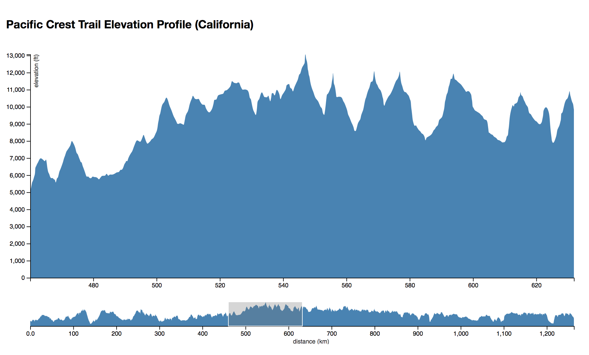

# 13-d3-brush
We'll take a look at `d3-brush` for adding the ability to filter the data in our chart by using the chart itself! We'll make a zoomable and brushable [elevation profile](https://www.pctmap.net/wp-content/uploads/pct/california_pct_elevation.pdf) of the Pacific Crest Trail in California from Mexico to Oregon.

## Resources
- [d3-brush](https://github.com/d3/d3-brush)
- [d3-zoom](https://github.com/d3/d3-zoom)

### More d3-brush Examples
- [brushable scatterplot](https://bl.ocks.org/EfratVil/0e542f5fc426065dd1d4b6daaa345a9f/65707c9d38363786fc20aa4ebf5cc5baf27adf6e)
- [custom brush handles](https://bl.ocks.org/mbostock/4349545)
- [programmatically set position of multiple x brushes](http://blockbuilder.org/clhenrick/282c8e050fd7695fdcf14bda6d352c26)
- [I am Sitting in a Room (web audio API)](https://bl.ocks.org/alexmacy/f25c39867546f8c72af13cb7e5bc654a/efecbe828d108797c834f6c138d246379282ce05)
- [brushable quadtree](https://bl.ocks.org/mbostock/4343214/1e24b8abaf72093720108462bf28c062dae1e49b)
- [brushable scatterplot & choropleth map](https://bl.ocks.org/cmgiven/abca90f6ba5f0a14c54d1eb952f8949c)
- [brush & zoom](https://bl.ocks.org/mbostock/f48fcdb929a620ed97877e4678ab15e6/f9a47162d322e27c2d862ee88485d3b614dfc77e)
- [Mona Lisa histogram](https://bl.ocks.org/mbostock/0d20834e3d5a46138752f86b9b79727e/dd3a762e4a1df0e2eaeed4f3232bcdd9935def15)